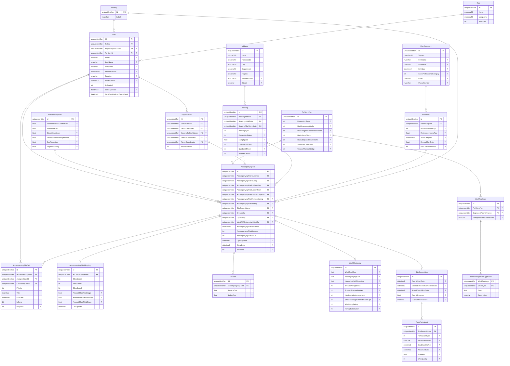

# Documentation technique de Renée

> **Version du document :** 1.0
> **Date de rédaction :** 15 juillet 2026
> **Public concerné :** développeurs, architectes logiciels, DevOps, équipes de maintenance

---

## Sommaire

1. [Présentation de l'application](#1-présentation-de-lapplication)
2. [Architecture générale](#2-architecture-générale)
3. [Structure du dépôt](#3-structure-du-dépôt)
4. [Couche Domain](#4-couche-domain)
5. [Couche Application](#5-couche-application)
6. [Couche Infrastructure](#6-couche-infrastructure)
7. [Couche UI](#7-couche-ui)
8. [Serveur MCP](#8-serveur-mcp)
9. [Modèle de données](#9-modèle-de-données)
10. [Authentification et autorisations](#10-authentification-et-autorisations)
11. [Intégrations externes](#11-intégrations-externes)
12. [IA et assistant conversationnel](#12-ia-et-assistant-conversationnel)
13. [Configuration et déploiement](#13-configuration-et-déploiement)
14. [Conventions de développement](#14-conventions-de-développement)

---

## 1. Présentation de l'application

Renée est une application web de suivi des accompagnements liés à la rénovation de logements et à la lutte contre l'exclusion énergétique. Elle couvre :

- la gestion des dossiers ménage (création, jalons, validation, abandon, clôture) ;
- le suivi du logement, du ménage, du plan de travaux et du plan de financement ;
- la coordination d'équipes d'accompagnement (Ensembliers Solidaires, Ensembliers Territoriaux, Coordinateurs) ;
- la facturation jalonnée et la gestion des factures ;
- un parcours dédié aux copropriétés ;
- des tableaux de bord et exports ;
- une administration des comptes, structures et territoires ;
- un assistant conversationnel basé sur Azure OpenAI.

La version documentée ici correspond à l'état du code au 9 juillet 2026.

---

## 2. Architecture générale

### 2.1 Style architectural

Renée suit une architecture en **couches verticales** inspirée de la Clean Architecture :

```
┌──────────────────────────────────────┐
│         Renee.UI (Blazor Server)     │  ← Couche Présentation
├──────────────────────────────────────┤
│       Renee.Application              │  ← Couche Application (CQRS, MediatR)
├──────────────────────────────────────┤
│       Renee.Domain                   │  ← Couche Domaine (entités, règles)
├──────────────────────────────────────┤
│       Renee.Infrastructure           │  ← Couche Infrastructure (EF Core, API externes)
└──────────────────────────────────────┘
```

Un serveur MCP autonome (`Renee.McpServer`) expose des outils d'accès aux données pour des agents IA externes.

### 2.2 Principaux flux

- L'interface utilisateur déclenche des commandes ou des requêtes via des services applicatifs ou MediatR.
- Les commandes modifient l'état (via les repositories).
- Les requêtes lisent les données (via EF Core ou des vues).
- Les événements métier génèrent des emails via des stratégies d'envoi.

---

## 3. Structure du dépôt

```
renee/
├── src/
│   ├── Renee.Domain/           Entités, énumérations, contrats de repositories, constantes
│   ├── Renee.Application/      Services, commandes, requêtes, DTOs, handlers MediatR
│   ├── Renee.Infrastructure/   EF Core, repositories, services externes, migrations
│   ├── Renee.UI/               Application Blazor Server
│   └── Renee.MigrationTool/    Outil CLI de migration des données chiffrées
├── mcpserver/
│   └── Renee.McpServer/        Serveur MCP pour agents IA (API REST + JWT)
├── functions/
│   └── SftpCsvImportFunction/  Azure Function d'import CSV depuis SFTP
├── tests/
│   ├── CommandHandlerTests/    Tests unitaires des handlers de commandes
│   ├── QueryHandlerTests/      Tests unitaires des handlers de requêtes
│   └── UITests/                Tests d'interface
└── docs/                       Documentation fonctionnelle et technique
```

---

## 4. Couche Domain

### 4.1 Rôle

La couche Domain contient :

- les entités métier (classes C# POCO générées par EF Core scaffolding) ;
- les énumérations métier ;
- les interfaces de repositories (contrats) ;
- les constantes métier et les erreurs domaine ;
- les prompts AI.

Cette couche n'a aucune dépendance vers les couches supérieures.

### 4.2 Entités principales

| Entité                       | Rôle                                             |
| ---------------------------- | ------------------------------------------------ |
| `AccompanyingFile`           | Dossier ménage, entité pivot du domaine          |
| `Household`                  | Ménage (composition, revenus, contexte social)   |
| `MainOccupant`               | Occupant principal avec trigramme identifiant    |
| `SecondaryOccupant`          | Occupants supplémentaires du ménage              |
| `Housing`                    | Logement (type, surface, état, adresse)          |
| `Address`                    | Adresse (rue, CP, ville, région)                 |
| `HousingInitialState`        | État DPE/GES avant travaux                       |
| `HousingAfterWorkState`      | État DPE/GES estimé après travaux                |
| `SupportTeam`                | Équipe d'accompagnement (ES, ET, coordinateurs)  |
| `PreWorkPlan`                | Plan de travaux envisagés                        |
| `PreFinancingPlan`           | Plan de financement des travaux                  |
| `WorkMonitoring`             | Suivi des travaux en cours d'exécution           |
| `SiteSupervision`            | Supervision de chantier                          |
| `AccompanyingFileTask`       | Tâches rattachées au dossier                     |
| `AccompanyingFileBillingLog` | Facturation jalonnée (J1/J2/J3)                  |
| `Invoice`                    | Factures unitaires rattachées au dossier         |
| `User`                       | Utilisateur avec rôle et rattachement territoire |
| `Role`                       | Référentiel des rôles                            |
| `Territory`                  | Territoire de rattachement                       |
| `CopropertyProfile`          | Dossier copropriété (parcours distinct)          |

Voir le document [mcd_mld_principal_menage.md](mcd_mld_principal_menage.md) pour le détail du modèle conceptuel et relationnel.

### 4.3 Énumérations clés

| Énumération              | Valeurs                                                                                     |
| ------------------------ | ------------------------------------------------------------------------------------------- |
| `AccompanyingFileStage`  | `Identify`, `OrganizingAndFinancing`, `RealisationAndFollowing`, `Finished`                 |
| `AccompanyingFileStatus` | `InProgress`, `Rejected`, `Finished`, `WaitingForApproval`, `WaitingForAbortion`, `Aborted` |

### 4.4 Constantes

Le fichier `Constants.cs` centralise les noms de rôles référencés dans les policies d'autorisation.

---

## 5. Couche Application

### 5.1 Pattern CQRS avec MediatR

L'application utilise **MediatR** pour dispatcher commandes et requêtes. Chaque cas d'usage est encapsulé dans :

- un objet de commande/requête (`Commands/`, `Queries/`) ;
- un handler correspondant (`Handlers/`) ;
- un DTO de résultat (`DTOs/`).

### 5.2 Services applicatifs

Les services applicatifs sont enregistrés par `DependencyInjection.WithApplication()`. Les principaux sont :

| Service                     | Responsabilité                                  |
| --------------------------- | ----------------------------------------------- |
| `IAccompanyingFileService`  | Orchestration du cycle de vie du dossier ménage |
| `IUserService`              | Gestion des comptes utilisateurs                |
| `IUserValidationService`    | Validation des inscriptions                     |
| `IFinancialAidService`      | Calculs et gestion des aides financières        |
| `ITaskService`              | Gestion des tâches rattachées aux dossiers      |
| `ISupportTeamService`       | Composition et mise à jour des équipes          |
| `ICopropertyProfileService` | Gestion du parcours copropriété                 |
| `IGenerateFilesService`     | Génération des documents (synthèses, exports)   |
| `IImportCsvDataService`     | Import de données CSV                           |
| `IImportExcelDataService`   | Import de données Excel                         |
| `IImpersonateService`       | Usurpation d'identité (admin uniquement)        |

### 5.3 Stratégies d'envoi de mail

Les emails sont envoyés via un pattern **Strategy** : chaque événement métier dispose d'une stratégie dédiée héritant de `ISendMailStrategy`.

| Stratégie                                  | Déclencheur                                 |
| ------------------------------------------ | ------------------------------------------- |
| `StageReadyMailStrategy`                   | Soumission d'un jalon                       |
| `StageValidatedMailStrategy`               | Validation d'un jalon                       |
| `StageRefusedMailStrategy`                 | Rejet d'un jalon                            |
| `AbortAccompanyingFileRequestMailStrategy` | Demande d'abandon                           |
| `AbortMailStrategy`                        | Confirmation d'abandon                      |
| `AbortCancellationMailStrategy`            | Annulation de la demande d'abandon          |
| `InscriptionConfirmationMailStrategy`      | Confirmation d'inscription                  |
| `InscriptionAdminWaitingMailStrategy`      | Notification admin en attente de validation |
| `InscriptionUserWaitingMailStrategy`       | Notification utilisateur en attente         |
| `InscriptionRefusedMailStrategy`           | Refus d'inscription                         |
| `TaskAssignedMailStrategy`                 | Attribution d'une tâche                     |
| `TaskCompletedMailStrategy`                | Clôture d'une tâche                         |
| `TaskDeletedMailStrategy`                  | Suppression d'une tâche                     |
| `CreationCodeMailStrategy`                 | Envoi d'un code de création de compte       |

### 5.4 Télémétrie

Le service `ITelemetryService` (singleton) centralise les événements applicatifs envoyés à Application Insights.

---

## 6. Couche Infrastructure

### 6.1 Accès aux données

- ORM : **Entity Framework Core** avec SQL Server.
- Contexte principal : `ReneeDbContext` (fabrique `IDbContextFactory<ReneeDbContext>` enregistrée en DI).
- Timeout de commande : 60 secondes.
- Les migrations sont gérées via EF Core et stockées dans `src/Renee.Infrastructure/Migrations/`.

### 6.2 Repositories

Chaque entité principale dispose d'une interface de repository dans `Renee.Domain/Repositories/` et d'une implémentation dans `Renee.Infrastructure/Repositories/`.

### 6.3 Services d'infrastructure

| Service                               | Rôle                                                          |
| ------------------------------------- | ------------------------------------------------------------- |
| `IFileService` / `IFileViewerService` | Lecture et écriture des fichiers dans Azure Blob Storage      |
| `IEncryptionService`                  | Chiffrement AES des données sensibles (clés dans Key Vault)   |
| `IEmailSenderService`                 | Envoi d'emails via Brevo (avec fallback SendGrid configuré)   |
| `IAirtableService`                    | Export vers Airtable                                          |
| `IAIDossierSynthesisService`          | Analyse IA des dossiers (Azure OpenAI)                        |
| `GraphApiClientService`               | Accès Microsoft Graph (gestion des identités Azure AD B2C)    |
| `AddressApiService`                   | Appel de l'API Adresse du gouvernement (adresse.data.gouv.fr) |
| `JwtGeneratorService`                 | Génération des tokens JWT pour le serveur MCP                 |

### 6.4 Stockage de fichiers (Azure Blob Storage)

- Conteneur configuré via `BlobStorageAzure:ContainerName`.
- Les fichiers sont chiffrés avant stockage avec une clé AES définie dans la configuration.

---

## 7. Couche UI

### 7.1 Framework

L'interface est construite avec **Blazor Server** (.NET). Le rendu est interactif côté serveur (SignalR).

Bibliothèques principales :

- **Radzen** : composants UI (grilles, formulaires, modales, notifications).
- **Blazored.Modal** : gestion des fenêtres modales.
- **BlazorContextMenu** : menus contextuels.
- **Microsoft.Identity.Web** : authentification OpenID Connect avec Azure AD B2C.

### 7.2 Structure des composants

```
Components/
├── Features/           Pages et composants par domaine métier
├── FormComponents/     Champs et formulaires réutilisables
├── DisplayComponents/  Composants d'affichage
├── Layout/             Layouts globaux, navigation par jalon, gestion des synthèses
├── Shared/             Composants partagés transverses
├── CGUHandling/        Gestion des CGU (acceptation obligatoire à la connexion)
├── ErrorHandling/      Pages et composants de gestion des erreurs
└── MiddleWare/         Middlewares HTTP (gestion des erreurs, sécurité)
```

### 7.3 Gestion de l'état

- `IStageNavigationStateService` / `StageNavigationStateService` : état de navigation dans les jalons.
- `SynthesysLayoutStateManager` : état du layout de synthèse.
- `AccompanyingFileListFilterDataPersistance` : persistance des filtres de liste.
- `NavigationHistoryManager` : historique de navigation.
- `UnsavedChangesGuard` : protection contre la perte de données non sauvegardées.

### 7.4 Authentification dans l'UI

- `ImpersonationAuthenticationStateProvider` : surcharge du provider d'authentification standard pour prendre en charge l'usurpation d'identité par les administrateurs.
- L'authentification principale utilise OpenID Connect via Azure AD B2C.

### 7.5 Policies d'autorisation

Deux policies sont définies dans `Program.cs` :

| Policy                       | Condition                                                              |
| ---------------------------- | ---------------------------------------------------------------------- |
| `CsvFileAccessPolicy`        | Rôle Admin, ou rôle ES appartenant à la structure "SOLIHA GRAND PARIS" |
| `AnahGrantCheckAccessPolicy` | Rôle ES + claim `ShouldCheckAnahFiles=true`                            |

### 7.6 Internationalisation

La culture est forcée à `fr-FR` pour l'ensemble de l'application (formatage des dates, nombres et monnaies).

---

## 8. Serveur MCP

### 8.1 Rôle

Le serveur MCP (`Renee.McpServer`) est un composant autonome qui expose des outils d'accès aux données de Renée pour des agents IA externes (assistants, copilots). Il fonctionne en mode API REST sécurisé par JWT.

### 8.2 Authentification

- Tokens JWT signés avec la clé `JwtGenerationKey:SecretKey`.
- Les tokens sont générés par l'application principale via `JwtGeneratorService`.
- Le serveur MCP valide l'issuer, l'audience, la signature et la durée de vie du token.

### 8.3 Outils disponibles

| Outil                             | Responsabilité                          |
| --------------------------------- | --------------------------------------- |
| `AccompanyingFileGetTools`        | Consultation et recherche de dossiers   |
| `AccompanyingFileCreateTools`     | Création de dossiers                    |
| `AccompanyingFileEnrichmentTools` | Enrichissement des données d'un dossier |
| `AccompanyingFileBillingTools`    | Consultation des données de facturation |
| `AddressTools`                    | Résolution d'adresses                   |
| `EligibilityTools`                | Calcul d'éligibilité                    |

### 8.4 Configuration réseau

Le point d'entrée MCP est exposé à l'UI via :

```json
"McpServerStream": {
  "MCPEndpoint": "",
  "MCPuri": "",
  "ProtocoleRequestHeader": "",
  "ProtocoleRequestHeaderValue": ""
}
```

---

## 9. Modèle de données

### 9.1 MCD — Propriétés des entités

> La propriété `DoHouseholdCanMobilizeSocialCircleOnConstructionSite_boolean` est une adaptation Mermaid (nom réel dans le schéma SQL : `DoHouseholdCanMobilizeSocialCircleOnConstructionSite : boolean`).

```mermaid
classDiagram
    class Role {
        Id
        Name
        LongName
        IsVisibled
    }

    class Territory {
        Id
        Label
    }

    class User {
        Id
        Email
        LastName
        FirstName
        PhoneNumber
        ReportingStructure
        Function
        SiretNumber
        IsDeleted
        IsAccountDeletionRequested
        IsFakeUser
        LastValidatedCGUDate
        LastValidatedCGUVersion
        LastLoginDate
        NextDateForAnahGrantCheck
    }

    class MainOccupant {
        Id
        Trigram
        Birthdate
        Age
        SocioProfessionalCategory
        PhoneNumber
        Email
        Job
        SocialProtectionFund
        CommentOnSocialProtectionFund
        PensionFund
        CommentOnPensionFund
        AdditionnalFund
        CommentOnAdditionnalFund
        Position
        FirstName
        LastName
    }

    class Household {
        Id
        HouseholdTypology
        IsFollowedByAnSocialWorker
        HasAnOccupantWithDisabilities
        HasAnOccupantWithLongTermIllness
        HasAnOccupantWithIndependenceLoss
        HasAnOccupantUnderCuratorship
        HasAnOccupantUnderGuardianship
        ReferenceIncomeTax
        AnahCategory
        SocialContext
        HouseholdProject
        HouseholdAvailabilityForVisits
        CommentsOnHouseholdDifficulties
        HasOverdueInvoice
        EnergyEffortRate
    }

    class Address {
        Id
        Label
        PostalCode
        City
        Department
        Region
        AdditionnalComment
        HouseNumber
        Street
    }

    class Housing {
        Id
        GeographicAreaTypology
        IsInABFArea
        ArchitecturalOrTownPlanningStandards
        OwnershipStatus
        HousingType
        ConstructionYear
        LivingSpace
        NumberOfRoom
        NumberOfFloor
        YearOfAcquisitionOrEntry
        CadastralReference
        SunExposure
        NumberOfDoor
        NumberOfWindow
        NumberOfPatioDoor
        NumberOfRoofDoor
        NumberOfBayWindow
        CeilingHeight
        HasPreviousWork
        CommentOnPreviousWork
    }

    class SupportTeam {
        Id
        MarkerNature
        CommentOnMarkerNature
        TrustedTierFirstName
        TrustedTierStructureName
        TrustedTierLastName
        TrustedTierPhoneNumber
        TrustedTierEmail
        TrustedTierRole
        CommentOnTrustedTierRole
    }

    class PreWorkPlan {
        Id
        RenovationType
        NextStepAndVigilancePoint
        HasInterestInPossibleARAProcess
        HasNeedForTemporaryReHousing
        HasEmergencyWorks
        HasEnergeticsRenovationWorks
        HasInducedWorks
        HasSafetyAndHealthWorks
        TreatedAirTightness
        TreatedThermalBridge
        AreExistingHumidityAndVaporMigrationManagedAfterTreatment
        IsARAOpeningStatementSent
        IsHouseholdReadyToStartARAProcess
        AreHouseholdPhysicalCapacitiesTakenIntoAccount
        DoHouseholdCanMobilizeSocialCircleOnConstructionSite
        WorksDetails
        HouseholdAvailabilitiyToOrganizeARASite
        IsRgeLabelUpToDate
        OtherQualification
    }

    class PreFinancingPlan {
        Id
        MaPrimeRenovGuidedPath
        MaPrimeRenovCoOwnerShip
        MaPrimeLogementDecent
        MaPrimeAdapt
        BonusForExitingEnergeticSieve
        RegionalAids
        DepartmentalAids
        PublicEstablishmentsForInterCommunalCooperationAids
        MunicipalityAids
        SolicitedBankLoanType
        ClassicBankLoan
        RemainingAmountFinancingSource
        IsFinancingAskedToStopAssociation
        EstimatedRemainingAmount
        MdphFinancing
        CeeFinancing
        CafMsaFinancing
        PensionFund
        UnderprivilegedHousingFoundation
        LeroyMerlinFoundation
        WattForChangeFoundation
        SocialProtectionGroup
        HouseholdMaximumSavingAmountForRenovationProject
        OtherFamilyMemberMaximumSupportAmountForRenovationProject
        StopEnergyExclusionFunds
    }

    class AccompanyingFile {
        Id
        AccompanyingFileReference
        AccompanyingFileMilestone
        AccompanyingFileStatus
        CommentOnBlockingProof
        FirstEncounterDate
        StartOfAccompanyingDate
        NumberOfEncounterWithFamilyForIdentificationMilestone
        OpeningDate
        LastUpdateDate
        CloseDate
        NumberOfEncounterWithFamilyForOrganizeAndFinanceMilestone
        EndOfAccompanyingDate
        EndOfEncounterDate
        NumberOfEncounterWithFamilyForRealizeAndFollowMilestone
        ZeroEnergyExclusionTerritoriesProgram
        IsDeleted
        AccompanyingType
        DeliveryTime
        IdentifySynthesisValidationDate
        OrganizeAndFinanceSynthesisValidationDate
        RealizeAndFollowSynthesisValidationDate
        RejectionCommentOnSynthesisValidation
        ExternalReference
        AccompanyingTimeDurationForIdentificationMilestone
        AccompanyingTimeDurationForOrganizeAndFinanceMilestone
        AccompanyingTimeDurationForRealizeAndFollowMilestone
        OtherAbortReason
        ShouldAccompanyingFileBeSubmittedToAnah
        AnahFolderFilingDate
        AnahFolderNumber
        ValidatorAbortComment
        AbortDecidedAt
        AbortRequestedAt
        HasAbortAttachment
        IsAbortBillingRequested
        SolidarBuilderAbortRequestDetails
        AnahGrantDate
    }

    class AccompanyingFileTask {
        Id
        Priority
        Title
        DueDate
        IsDone
        Progress
        StartDate
    }

    class AccompanyingFileBillingLog {
        Id
        BilledJalon1
        BilledJalon2
        BilledJalon3
        LastUpdate
        AmountBilledFirstStage
        AmountBilledSecondStage
        AmountBilledThirdStage
        BillingCallNumberFirstStage
        BillingCallNumberSecondStage
        BillingCallNumberThirdStage
        BillingDateFirstStage
        BillingDateSecondStage
        BillingDateThirdStage
        FundraisingLauchDateForFirstStage
        FundraisingLauchDateForSecondStage
        FundraisingLauchDateForThirdStage
        InvoiceNumberFirstStage
        InvoiceNumberSecondStage
        InvoiceNumberThirdStage
    }

    class Invoice {
        Id
        InvoiceCost
        LaborCost
    }

    class WorkMonitoring {
        Id
        AccompanyingCost
        HouseholdSelfFinancing
        IntermediateAirtightnessTestResult
        JustificationAndActionsPutInPlaceIfNoTest
        HasWorksEnabledHouseholdToStayAtHome
        WellBeingRating
        EducationalFrameworkRating
        FamilySatisfaction
        ReturnToEmployment
        HasHousingAdaptationWorks
        HasFinishingWorks
        HasSafetyWorks
        HasPreparationWorks
        HasEmergencyWorks
        HasUnsanitaryExit
        TreatedAirTightness
        TreatedThermalBridges
        HasHumidityManagement
        WorkTotalCost
        HasEffectiveComplianceWithWorkRecommendations
        ShouldChangeFinalEstimatedDpe
    }

    class SiteSupervision {
        Id
        OverallStartDate
        EstimatedOverallCompletionDate
        ActualOverallEndDate
        OverallProgress
        NextCoordinationMeetingScheduledFor
        OverallObservations
        PreSiteSupervisionMeetingDate
    }

    class WorkParticipant {
        Id
        ParticipantType
        WorkTypesLabel
        ParticipantName
        ContactAdvisor
        StartDateOfWork
        EstimatedCompletionDate
        ActualEndDate
        Progress
        WorkQuality
        CommentOnWorkQuality
        CommentOnWorkParticipantDifficulties
        SpecificComments
    }

    class WorkPackage {
        Id
        EnergeticsEffectAfterWorks
    }

    class WorkPackageWorkTypeCost {
        WorkPackage
        WorkType
        Cost
        Description
    }

    Role "1" --> "0..*" User : attribue
    Territory "1" --> "0..*" User : rattache
    Territory "1" --> "0..*" AccompanyingFile : couvre

    MainOccupant "1" --> "0..*" Household : principal
    Household "1" --> "0..*" AccompanyingFile : concerne

    Address "1" --> "0..*" Housing : localise
    Housing "1" --> "0..*" AccompanyingFile : supporte

    SupportTeam "1" --> "0..*" AccompanyingFile : accompagne
    User "1" --> "0..*" SupportTeam : compose

    PreWorkPlan "1" --> "0..*" AccompanyingFile : planifie
    PreFinancingPlan "1" --> "0..*" AccompanyingFile : finance

    User "1" --> "0..*" AccompanyingFile : cree_maj_valide

    AccompanyingFile "1" --> "0..*" AccompanyingFileTask : pilote
    User "1" --> "0..*" AccompanyingFileTask : assigne

    AccompanyingFile "1" --> "0..1" AccompanyingFileBillingLog : facture_par_jalon
    AccompanyingFile "1" --> "0..*" Invoice : enregistre_factures

    AccompanyingFile "1" --> "0..1" WorkMonitoring : suit_les_travaux
    AccompanyingFile "1" --> "0..1" SiteSupervision : supervise_le_chantier
    SiteSupervision "1" --> "0..*" WorkParticipant : implique
    PreWorkPlan "1" --> "0..*" WorkPackage : decompose_en
    WorkPackage "1" --> "0..*" WorkPackageWorkTypeCost : valorise_par
```



### 9.2 MLD — Modèle Logique de Données



**Conventions**

| Symbole    | Signification                     |
| ---------- | --------------------------------- |
| <u>Id</u>  | Clé primaire                      |
| `#Colonne` | Clé étrangère                     |
| `type?`    | Colonne nullable (`NULL`)         |
| `type`     | Colonne non nullable (`NOT NULL`) |

> **Note :** La colonne `DoHouseholdCanMobilizeSocialCircleOnConstructionSite : boolean` de la table `PreWorkPlan` comporte `: boolean` dans son nom SQL (anomalie de nommage du schéma). Le type réel est `bit?`.

---

#### Role

- <u>Id</u>: uniqueidentifier
- Name: nvarchar(50)
- LongName: nvarchar(50)
- IsVisibled: bit

#### Territory

- <u>Id</u>: uniqueidentifier
- Label: nvarchar(max)

#### User

- <u>Id</u>: uniqueidentifier
- #RoleId: uniqueidentifier
- #ReportingStructureId: uniqueidentifier?
- #TerritoryId: uniqueidentifier?
- Email: nvarchar(max)?
- LastName: nvarchar(max)?
- FirstName: nvarchar(max)?
- PhoneNumber: nvarchar(50)?
- ReportingStructure: nvarchar(max)?
- Function: nvarchar(max)?
- SiretNumber: varchar(14)?
- IsDeleted: bit
- IsAccountDeletionRequested: bit
- IsFakeUser: bit?
- LastValidatedCGUDate: datetime2(7)?
- LastValidatedCGUVersion: nvarchar(max)?
- LastLoginDate: datetime2(7)?
- NextDateForAnahGrantCheck: datetime2(7)

#### MainOccupant

- <u>Id</u>: uniqueidentifier
- Trigram: nvarchar(50)
- Birthdate: datetime2(7)?
- Age: int?
- SocioProfessionalCategory: int?
- PhoneNumber: nvarchar(max)?
- Email: nvarchar(max)?
- Job: nvarchar(max)?
- SocialProtectionFund: int?
- CommentOnSocialProtectionFund: nvarchar(max)?
- PensionFund: int?
- CommentOnPensionFund: nvarchar(max)?
- AdditionnalFund: int?
- CommentOnAdditionnalFund: nvarchar(max)?
- Position: int?
- FirstName: nvarchar(max)?
- LastName: nvarchar(max)?

#### Household

- <u>Id</u>: uniqueidentifier
- #MainOccupant: uniqueidentifier
- HouseholdTypology: int?
- IsFollowedByAnSocialWorker: bit?
- HasAnOccupantWithDisabilities: bit?
- HasAnOccupantWithLongTermIllness: bit?
- HasAnOccupantWithIndependenceLoss: bit?
- HasAnOccupantUnderCuratorship: bit?
- HasAnOccupantUnderGuardianship: bit?
- ReferenceIncomeTax: float?
- AnahCategory: nvarchar(50)?
- SocialContext: nvarchar(max)?
- HouseholdProject: nvarchar(max)?
- HouseholdAvailabilityForVisits: nvarchar(max)?
- CommentsOnHouseholdDifficulties: nvarchar(max)?
- HasOverdueInvoice: bit?
- EnergyEffortRate: float?

#### Address

- <u>Id</u>: uniqueidentifier
- Label: varchar(100)
- PostalCode: nvarchar(50)
- City: nvarchar(50)
- Department: nvarchar(50)
- Region: nvarchar(50)
- AdditionnalComment: varchar(50)?
- HouseNumber: nvarchar(50)?
- Street: nvarchar(max)?

#### Housing

- <u>Id</u>: uniqueidentifier
- #HousingAddress: uniqueidentifier
- #HousingInitialState: uniqueidentifier
- #HousingAfterWorkState: uniqueidentifier
- GeographicAreaTypology: int?
- IsInABFArea: bit?
- ArchitecturalOrTownPlanningStandards: nvarchar(max)?
- OwnershipStatus: int?
- HousingType: int?
- ConstructionYear: int?
- LivingSpace: float?
- NumberOfRoom: int?
- NumberOfFloor: int?
- YearOfAcquisitionOrEntry: int?
- CadastralReference: nvarchar(max)?
- SunExposure: int?
- NumberOfDoor: int?
- NumberOfWindow: int?
- NumberOfPatioDoor: int?
- NumberOfRoofDoor: int?
- NumberOfBayWindow: int?
- CeilingHeight: float?
- HasPreviousWork: bit?
- CommentOnPreviousWork: nvarchar(max)?

#### SupportTeam

- <u>Id</u>: uniqueidentifier
- #SolidarBuilder: uniqueidentifier
- #TerritorialBuilder: uniqueidentifier?
- #SecondSolidarBuilder: uniqueidentifier?
- #ThirdSolidarBuilder: uniqueidentifier?
- #DiffuseCoordinator: uniqueidentifier?
- #TargetCoordinator: uniqueidentifier?
- #SecondTerritorialBuilder: uniqueidentifier?
- MarkerNature: int
- CommentOnMarkerNature: nvarchar(max)?
- TrustedTierFirstName: nvarchar(max)?
- TrustedTierStructureName: nvarchar(max)?
- TrustedTierLastName: nvarchar(max)?
- TrustedTierPhoneNumber: nvarchar(max)?
- TrustedTierEmail: nvarchar(max)?
- TrustedTierRole: int?
- CommentOnTrustedTierRole: nvarchar(max)?

#### PreWorkPlan

- <u>Id</u>: uniqueidentifier
- RenovationType: int?
- NextStepAndVigilancePoint: nvarchar(max)?
- HasInterestInPossibleARAProcess: bit?
- HasNeedForTemporaryReHousing: bit?
- HasEmergencyWorks: bit?
- HasEnergeticsRenovationWorks: bit?
- HasInducedWorks: bit?
- HasSafetyAndHealthWorks: bit?
- TreatedAirTightness: int?
- TreatedThermalBridge: int?
- AreExistingHumidityAndVaporMigrationManagedAfterTreatment: int?
- IsARAOpeningStatementSent: bit?
- IsHouseholdReadyToStartARAProcess: bit?
- AreHouseholdPhysicalCapacitiesTakenIntoAccount: bit?
- DoHouseholdCanMobilizeSocialCircleOnConstructionSite : boolean: bit?
- WorksDetails: nvarchar(max)?
- HouseholdAvailabilitiyToOrganizeARASite: nvarchar(max)?
- IsRgeLabelUpToDate: bit?
- OtherQualification: nvarchar(max)?

#### PreFinancingPlan

- <u>Id</u>: uniqueidentifier
- MaPrimeRenovGuidedPath: float?
- MaPrimeRenovCoOwnerShip: float?
- MaPrimeLogementDecent: float?
- MaPrimeAdapt: float?
- BonusForExitingEnergeticSieve: float?
- RegionalAids: float?
- DepartmentalAids: float?
- PublicEstablishmentsForInterCommunalCooperationAids: float?
- MunicipalityAids: float?
- SolicitedBankLoanType: nvarchar(50)?
- ClassicBankLoan: float?
- RemainingAmountFinancingSource: nvarchar(50)?
- IsFinancingAskedToStopAssociation: bit?
- EstimatedRemainingAmount: float?
- MdphFinancing: float?
- CeeFinancing: float?
- CafMsaFinancing: float?
- PensionFund: float?
- UnderprivilegedHousingFoundation: float?
- LeroyMerlinFoundation: float?
- WattForChangeFoundation: float?
- SocialProtectionGroup: float?
- HouseholdMaximumSavingAmountForRenovationProject: float?
- OtherFamilyMemberMaximumSupportAmountForRenovationProject: float?
- StopEnergyExclusionFunds: float?

#### AccompanyingFile

- <u>Id</u>: uniqueidentifier
- #AccompanyingFileHousehold: uniqueidentifier
- #AccompanyingFileHousing: uniqueidentifier
- #AccompanyingFilePreWorkPlan: uniqueidentifier
- #AccompanyingFileSupportTeam: uniqueidentifier
- #AccompanyingFilePreFinancingPlan: uniqueidentifier
- #AccompanyingFileWorkMonitoring: uniqueidentifier?
- AccompanyingFileReference: nvarchar(50)
- AccompanyingFileMilestone: int
- AccompanyingFileStatus: int
- CommentOnBlockingProof: nvarchar(max)?
- FirstEncounterDate: datetime2(7)?
- StartOfAccompanyingDate: datetime2(7)?
- NumberOfEncounterWithFamilyForIdentificationMilestone: int?
- #CreatedBy: uniqueidentifier?
- #UpdatedBy: uniqueidentifier?
- #ClosedBy: uniqueidentifier?
- OpeningDate: datetime2(7)?
- LastUpdateDate: datetime2(7)?
- CloseDate: datetime2(7)?
- NumberOfEncounterWithFamilyForOrganizeAndFinanceMilestone: int?
- EndOfAccompanyingDate: datetime2(7)?
- EndOfEncounterDate: datetime2(7)?
- NumberOfEncounterWithFamilyForRealizeAndFollowMilestone: int?
- ZeroEnergyExclusionTerritoriesProgram: bit?
- IsDeleted: bit?
- AccompanyingType: int?
- #AccompanyingFileTerritory: uniqueidentifier?
- DeliveryTime: int?
- IdentifySynthesisValidationDate: datetime2(7)?
- OrganizeAndFinanceSynthesisValidationDate: datetime2(7)?
- RealizeAndFollowSynthesisValidationDate: datetime2(7)?
- RejectionCommentOnSynthesisValidation: nvarchar(max)?
- #IdentifyMilestoneValidatedBy: uniqueidentifier?
- #OrganizeAndFinanceMilestoneValidatedBy: uniqueidentifier?
- #RealizeAndFollowMilestoneValidatedBy: uniqueidentifier?
- ExternalReference: nvarchar(max)?
- AccompanyingTimeDurationForIdentificationMilestone: int?
- AccompanyingTimeDurationForOrganizeAndFinanceMilestone: int?
- AccompanyingTimeDurationForRealizeAndFollowMilestone: int?
- #ImportRunId: uniqueidentifier?
- #AbortReasonLabelId: uniqueidentifier?
- OtherAbortReason: nvarchar(max)?
- ShouldAccompanyingFileBeSubmittedToAnah: bit?
- AnahFolderFilingDate: datetime2(7)?
- AnahFolderNumber: nvarchar(max)?
- ValidatorAbortComment: nvarchar(max)?
- #SiteSupervisionId: uniqueidentifier?
- AbortDecidedAt: datetime2(7)?
- #AbortDecidedById: uniqueidentifier?
- AbortRequestedAt: datetime2(7)?
- #AbortRequestedById: uniqueidentifier?
- HasAbortAttachment: bit?
- IsAbortBillingRequested: bit?
- SolidarBuilderAbortRequestDetails: nvarchar(max)?
- AnahGrantDate: datetime2(7)?
- #CopropertyProfileId: uniqueidentifier?

#### AccompanyingFileTask

- <u>Id</u>: uniqueidentifier
- #AccompanyingFileId: uniqueidentifier
- #AssignedUserId: uniqueidentifier
- #CreatedByUserId: uniqueidentifier
- Priority: int
- Title: nvarchar(max)
- DueDate: datetime2(7)
- IsDone: bit
- Progress: int?
- StartDate: datetime2(7)

#### AccompanyingFileBillingLog

- <u>Id</u>: uniqueidentifier
- #AccompanyingFileId: uniqueidentifier
- BilledJalon1: bit
- BilledJalon2: bit
- BilledJalon3: bit
- LastUpdate: datetime2(7)
- AmountBilledFirstStage: float?
- AmountBilledSecondStage: float?
- AmountBilledThirdStage: float?
- BillingCallNumberFirstStage: nvarchar(max)?
- BillingCallNumberSecondStage: nvarchar(max)?
- BillingCallNumberThirdStage: nvarchar(max)?
- BillingDateFirstStage: datetime2(7)?
- BillingDateSecondStage: datetime2(7)?
- BillingDateThirdStage: datetime2(7)?
- FundraisingLauchDateForFirstStage: datetime2(7)?
- FundraisingLauchDateForSecondStage: datetime2(7)?
- FundraisingLauchDateForThirdStage: datetime2(7)?
- InvoiceNumberFirstStage: nvarchar(max)?
- InvoiceNumberSecondStage: nvarchar(max)?
- InvoiceNumberThirdStage: nvarchar(max)?

#### Invoice

- <u>Id</u>: uniqueidentifier
- #AccompanyingFileId: uniqueidentifier
- InvoiceCost: float?
- LaborCost: float?

#### WorkMonitoring

- <u>Id</u>: uniqueidentifier
- AccompanyingCost: float?
- HouseholdSelfFinancing: float?
- IntermediateAirtightnessTestResult: nvarchar(max)?
- JustificationAndActionsPutInPlaceIfNoTest: nvarchar(max)?
- HasWorksEnabledHouseholdToStayAtHome: bit?
- WellBeingRating: int?
- EducationalFrameworkRating: int?
- FamilySatisfaction: int?
- ReturnToEmployment: bit?
- HasHousingAdaptationWorks: bit?
- HasFinishingWorks: bit?
- HasSafetyWorks: bit?
- HasPreparationWorks: bit?
- HasEmergencyWorks: bit?
- HasUnsanitaryExit: bit?
- TreatedAirTightness: int?
- TreatedThermalBridges: int?
- HasHumidityManagement: bit?
- WorkTotalCost: float?
- HasEffectiveComplianceWithWorkRecommendations: bit?
- ShouldChangeFinalEstimatedDpe: bit?

#### SiteSupervision

- <u>Id</u>: uniqueidentifier
- OverallStartDate: datetime2(7)?
- EstimatedOverallCompletionDate: datetime2(7)?
- ActualOverallEndDate: datetime2(7)?
- OverallProgress: float?
- NextCoordinationMeetingScheduledFor: datetime2(7)?
- OverallObservations: nvarchar(max)?
- PreSiteSupervisionMeetingDate: datetime2(7)?

#### WorkParticipant

- <u>Id</u>: uniqueidentifier
- #SiteSupervisionId: uniqueidentifier
- ParticipantType: int?
- WorkTypesLabel: nvarchar(max)?
- ParticipantName: nvarchar(max)?
- ContactAdvisor: nvarchar(max)?
- StartDateOfWork: datetime2(7)?
- EstimatedCompletionDate: datetime2(7)?
- ActualEndDate: datetime2(7)?
- Progress: float?
- WorkQuality: int?
- CommentOnWorkQuality: nvarchar(max)?
- CommentOnWorkParticipantDifficulties: nvarchar(max)?
- SpecificComments: nvarchar(max)?

#### WorkPackage

- <u>Id</u>: uniqueidentifier
- #PreWorkPlan: uniqueidentifier?
- #CopropertyWorkFinance: uniqueidentifier?
- EnergeticsEffectAfterWorks: nvarchar(max)?

#### WorkPackageWorkTypeCost

- <u>#WorkPackage</u>: uniqueidentifier
- <u>#WorkType</u>: uniqueidentifier
- Cost: float
- Description: nvarchar(max)?

---

### 9.3 Base de données

- Moteur : **SQL Server**.
- Schéma : `[dbo]`.
- ORM : **Entity Framework Core** en approche **Code First** (les classes C# sont la source de vérité, la base de données est générée par les migrations).
- Les migrations sont versionnées dans `src/Renee.Infrastructure/Migrations/`.
- Un historique de migration alternatif existe dans `Migrations_OLD/` pour les migrations initiales.
- Des scripts SQL annexes de migration sont conservés dans `MigrationScripts/`.

### 9.4 Tables principales (périmètre dossier ménage)

| Table                        | Rôle                           |
| ---------------------------- | ------------------------------ |
| `AccompanyingFile`           | Dossier ménage, entité pivot   |
| `Household`                  | Ménage                         |
| `MainOccupant`               | Occupant principal             |
| `SecondaryOccupant`          | Occupants secondaires          |
| `Housing`                    | Logement                       |
| `Address`                    | Adresse                        |
| `HousingInitialState`        | État initial du logement (DPE) |
| `HousingAfterWorkState`      | État post-travaux estimé       |
| `SupportTeam`                | Équipe d'accompagnement        |
| `PreWorkPlan`                | Plan de travaux                |
| `PreFinancingPlan`           | Plan de financement            |
| `WorkMonitoring`             | Suivi travaux                  |
| `WorkPackage`                | Lots de travaux                |
| `SiteSupervision`            | Supervision de chantier        |
| `AccompanyingFileTask`       | Tâches                         |
| `AccompanyingFileBillingLog` | Facturation jalonnée           |
| `Invoice`                    | Factures                       |
| `User`                       | Utilisateurs                   |
| `Role`                       | Rôles                          |
| `Territory`                  | Territoires                    |
| `ReportingStructure`         | Structures de rattachement     |

### 9.5 Tables de référence notables

| Table                         | Contenu                              |
| ----------------------------- | ------------------------------------ |
| `AnahCategory`                | Catégories ANAH d'éligibilité        |
| `HouseholdDifficultiesLabel`  | Labels des difficultés ménage        |
| `HouseholdResourcesLabel`     | Labels des ressources ménage         |
| `HouseholdHeatingEnergyLabel` | Labels des énergies de chauffage     |
| `WorkTypesLabel`              | Labels des types de travaux          |
| `InsuranceType`               | Types d'assurance chantier           |
| `ProjectType`                 | Types de projets de travaux          |
| `AbortReasonLabel`            | Labels des motifs d'abandon          |
| `AdminConstant`               | Constantes configurables par l'admin |

### 9.6 Tables du parcours copropriété

| Table                    | Rôle                                              |
| ------------------------ | ------------------------------------------------- |
| `CopropertyProfile`      | Dossier copropriété (équivalent AccompanyingFile) |
| `CopropertyHousing`      | Données immeuble                                  |
| `CopropertyGovernance`   | Syndic et AMO                                     |
| `CopropertyDiagnostics`  | DPE immeuble et appartements                      |
| `CopropertyWorkFinance`  | Financement travaux collectif                     |
| `CopropertyWorkTracking` | Suivi travaux collectif                           |

---

## 10. Authentification et autorisations

### 10.1 Fournisseur d'identité

- **Azure Active Directory B2C** via OpenID Connect.
- Configuration dans la section `AzureADB2C` de `appsettings.json` (Instance, Domain, TenantId, ClientId, PolicyIds).
- L'acquisition de token pour appeler Microsoft Graph est activée via `EnableTokenAcquisitionToCallDownstreamApi`.

### 10.2 Modèle de droits

L'accès aux dossiers repose sur trois dimensions cumulatives :

1. **Rôle** : attribut de l'utilisateur dans Renée (ES, ET, CD, CC, Admin, etc.).
2. **Rattachement** : l'utilisateur est explicitement membre de l'équipe du dossier.
3. **Territoire** : le territoire de l'utilisateur correspond à celui du dossier.

Aucun rôle ne donne à lui seul accès à tous les dossiers.

### 10.3 Rôles définis

| Code rôle                 | Libellé                                  |
| ------------------------- | ---------------------------------------- |
| `ES` (SolidarBuilder)     | Ensemblier Solidaire                     |
| `ET` (TerritorialBuilder) | Ensemblier Territorial                   |
| `CD` (DiffuseCoordinator) | Coordinateur du Diffus                   |
| `CC` (TargetCoordinator)  | Coordinateur du Ciblé                    |
| Référent structurel       | Référent de structure                    |
| Membre STOP               | Membre équipe Stop Exclusion Énergétique |
| `Admin`                   | Administrateur                           |

### 10.4 Usurpation d'identité

Les administrateurs peuvent usurper l'identité d'un utilisateur via `ImpersonateService`. La session d'usurpation est tracée en base via la table `Impersonate`.

---

## 11. Intégrations externes

### 11.1 Azure AD B2C

- Authentification et gestion du cycle de vie des comptes.
- `GraphApiClientService` gère les appels à Microsoft Graph API (création de compte, réinitialisation, suppression).

### 11.2 API Adresse (adresse.data.gouv.fr)

- `AddressApiService` interroge l'API gouvernementale de géocodage pour l'autocomplétion des adresses.
- Configuration : `AddressApiGouv:Uri`.

### 11.3 Azure Blob Storage

- Stockage des documents joints aux dossiers.
- Chiffrement AES avant upload.
- Configuration : `BlobStorageAzure` (ContainerName, clés de chiffrement dans Key Vault).

### 11.4 Brevo (envoi d'emails)

- Service principal d'envoi d'emails transactionnels.
- Configuration : `Brevo` (APIKey, APISender, APISenderName, FakeUserEmail pour les environnements de test).
- Un compte SendGrid est également configuré (`SendGrid:APIKey`) comme alternative.

### 11.5 Airtable

- Export de données de dossiers vers une base Airtable.
- Configuration : `Airtable` (Url, BaseId, TableId, token, URLs de retour).

### 11.6 Azure OpenAI (IA)

- Modèle déployé sur Azure AI Foundry.
- Utilisé pour l'assistant conversationnel et l'analyse des synthèses.
- Configuration : `AzureFoundryResources` (ClientUri, AzureKeyCredential, DeploymentName).

### 11.7 Azure Application Insights

- Télémétrie applicative (traces, exceptions, performances).
- Configuration : `ApplicationInsights:ConnectionString`.

### 11.8 Azure Function (import SFTP)

Le projet `functions/SftpCsvImportFunction` est une Azure Function déclenchée pour importer des fichiers CSV depuis un serveur SFTP. Les imports sont tracés via les tables `ImportRun` et `ImportError`.

---

## 12. IA et assistant conversationnel

### 12.1 Analyse des synthèses (AIDossierSynthesisService)

Le service `AIDossierSynthesisService` interroge Azure OpenAI pour analyser un dossier et détecter des anomalies avant soumission d'un jalon.

- Le dossier est sérialisé en JSON (valeurs nulles omises).
- La réponse de l'IA est parsée pour extraire une liste d'anomalies structurées :
    - `field` : champ concerné ;
    - `description` : explication ;
    - `jalon` : jalon associé (Identifier, Organiser et Financer, Réaliser et Suivre).
- Seuls les jalons connus sont acceptés (validation stricte côté service).

### 12.2 Assistant conversationnel (chat in-app)

- Intégré directement dans l'interface Blazor.
- Utilise `Microsoft.Extensions.AI` avec l'extension `UseFunctionInvocation()` pour permettre à l'assistant d'appeler des outils.
- L'assistant peut interroger le serveur MCP via des appels outillés.

### 12.3 Serveur MCP (outils AI)

Le serveur MCP expose des outils que des agents IA externes ou l'assistant in-app peuvent invoquer pour :

- consulter et créer des dossiers ;
- enrichir les données ;
- consulter la facturation ;
- calculer l'éligibilité ;
- résoudre des adresses.

---

## 13. Configuration et déploiement

### 13.1 Fichier de configuration principal

Le fichier `src/Renee.UI/appsettings.json` centralise toutes les clés de configuration. Toutes les valeurs sensibles doivent être injectées par les variables d'environnement ou un Key Vault en production.

| Section                              | Contenu                                                                                   |
| ------------------------------------ | ----------------------------------------------------------------------------------------- |
| `AzureADB2C`                         | Paramètres OpenID Connect (Instance, Domain, TenantId, ClientId, ClientSecret, PolicyIds) |
| `ConnectionStrings:ReneeDbContext`   | Chaîne de connexion SQL Server                                                            |
| `ConnectionStrings:AzureBlobStorage` | Chaîne de connexion Blob Storage                                                          |
| `SendGrid`                           | Clé API et expéditeur SendGrid                                                            |
| `Brevo`                              | Clé API et expéditeur Brevo                                                               |
| `Airtable`                           | URL, identifiants et tokens Airtable                                                      |
| `BlobStorageAzure`                   | Nom du conteneur et noms des clés de chiffrement                                          |
| `McpServerStream`                    | Endpoint et headers pour le serveur MCP                                                   |
| `AzureFoundryResources`              | URI, clé et nom de déploiement Azure OpenAI                                               |
| `JwtGenerationKey`                   | Clé secrète, issuer et audience pour les JWT MCP                                          |
| `ApplicationInsights`                | Chaîne de connexion Application Insights                                                  |
| `AddressApiGouv`                     | URI de l'API Adresse                                                                      |

### 13.2 Build

Deux tâches de build sont définies dans `.vscode/tasks.json` :

| Tâche                       | Commande                                                       |
| --------------------------- | -------------------------------------------------------------- |
| `Renee - build: UI`         | `dotnet build src/Renee.UI --configuration Debug`              |
| `Renee - build: MCP Server` | `dotnet build mcpserver/Renee.McpServer --configuration Debug` |
| `Renee - build: All`        | Les deux en parallèle                                          |

### 13.3 Solution

Le fichier `Renee.sln` à la racine inclut tous les projets du périmètre principal. Le serveur MCP possède sa propre solution `Renee.McpServer.sln`.

### 13.4 Migrations de base de données

Renée utilise EF Core en **Code First** : les modifications du schéma partent du code C# et sont propagées vers la base via des migrations.

Les fichiers de migration se trouvent dans `src/Renee.Infrastructure/Migrations/`.

```powershell
# Créer une nouvelle migration
dotnet ef migrations add <NomMigration> --project src/Renee.Infrastructure --startup-project src/Renee.UI

# Appliquer les migrations
dotnet ef database update --project src/Renee.Infrastructure --startup-project src/Renee.UI
```

> **Obligation : chiffrement de la migration**
> Toute migration ajoutée au dépôt doit être chiffrée à l'aide du projet `Renee.MigrationTool` avant d'être commitée.
> Le dépôt ne doit jamais contenir de fichier de migration en clair.

Le fichier `MigrationRequest.txt` dans `Renee.Infrastructure` liste les demandes de migration en attente.

### 13.5 Outil de migration (MigrationTool)

Le projet `Renee.MigrationTool` est un outil CLI .NET **obligatoire** pour chiffrer les fichiers de migration avant leur dépôt dans le dépôt de code. Il utilise `EncryptionFileService.cs` pour appliquer le chiffrement AES.

Étapes typiques :

1. Générer la migration avec `dotnet ef migrations add`.
2. Chiffrer le fichier de migration produit via `Renee.MigrationTool`.
3. Commiter uniquement le fichier chiffré.

---

## 14. Conventions de développement

### 14.1 Organisation du code

- Chaque entité du domaine dispose de son fichier propre dans `Renee.Domain/Entity/`.
- Les handlers MediatR sont dans `Renee.Application/Handlers/`.
- Les commandes et requêtes sont séparées : `Commands/` et `Queries/`.
- Les DTOs sont dans `Renee.Application/DTOs/`.
- Les interfaces de services applicatifs sont dans `Renee.Application/Interfaces/`.

### 14.2 Gestion des erreurs métier

Les opérations qui peuvent échouer retournent un `ReneeOperationResult<T>` (domaine `Renee.Domain.ReneeError`) plutôt que de lever des exceptions.

### 14.3 Injection de dépendances

Toutes les dépendances sont enregistrées en DI. Les points d'enregistrement sont :

- `Renee.Application.DependencyInjection.WithApplication()` ;
- `Renee.Infrastructure.DependencyInjection.WithDatabaseInfrastructure()` ;
- `Renee.UI.Program.cs` pour les services de l'UI.

### 14.4 Tests

| Projet                | Périmètre                                                                                |
| --------------------- | ---------------------------------------------------------------------------------------- |
| `CommandHandlerTests` | Tests unitaires des handlers de commandes (dossiers, tâches, utilisateurs, copropriétés) |
| `QueryHandlerTests`   | Tests unitaires des handlers de requêtes                                                 |
| `UITests`             | Tests d'interface                                                                        |
| `EnrichmentTextFiles` | Fichiers texte de test pour les fonctionnalités d'enrichissement IA                      |
